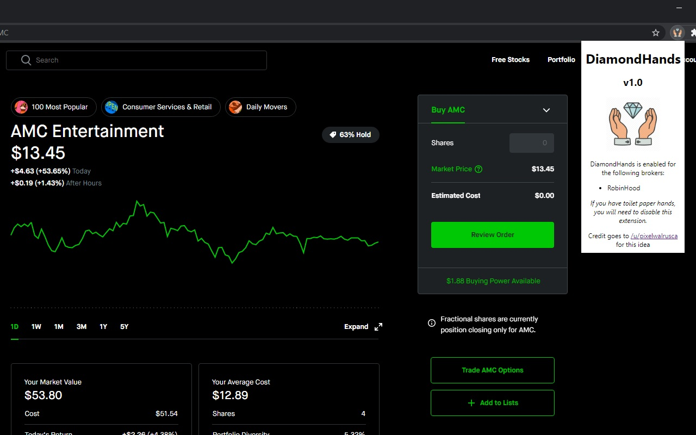

# DiamondHands-Chrome-Extension
 This extension keeps those bearish tempations at bay by diabling access to the sell button on select brokerage sites.

- I would love for others to contribute to this. At the moment, I haven't had time to find methods for blocking WeBull and some of the other brokers. If you use one of these other brokers and know of a way to disable their "Buy" buttons, feel free to add your code!

**Credit goes to [/u/pixelwalrusca](https://www.reddit.com/user/pixelwalrusca/) for this idea, I am just quickly throwing it together**
